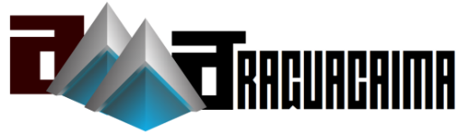
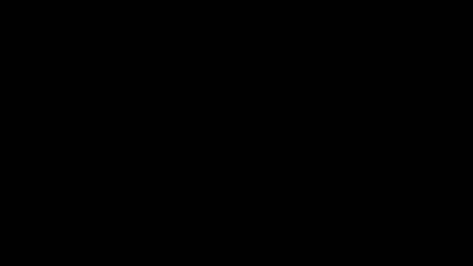
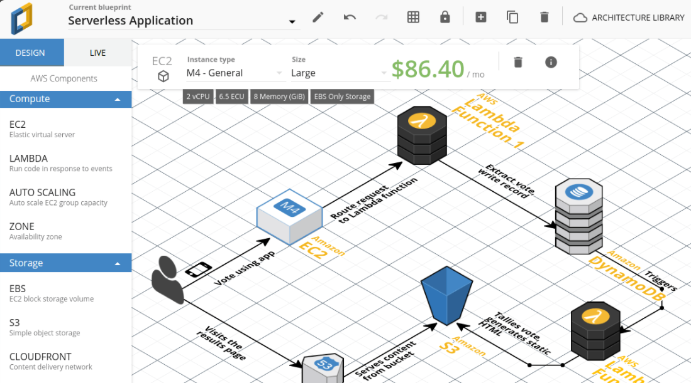
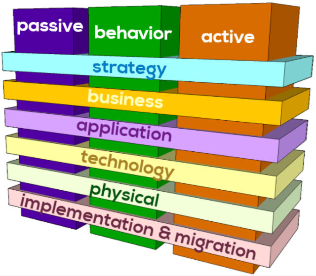

OpenArchi
===

ToC
===
  * [Brief description](#brief-description)
  * [OpenArchi in a Nutshell](#openarchi-in-a-nutshell)
  * [Tools](#tools)
  * [Features](#features)

Brief description
===

Open Archi is a social network for the management of enterprise architecture, using the concept of AMaaS - Architecture Model as a Service, including:

* Knowledge base of architectural components
* Intergration with the main business concepts (TOGAF and C4Model based Architecture Framework):
  * Enterprise Architecture
  * Applications Architecture
  * Data Architecture
  * Technological Architecture
* Whole capabilities fully APIfied
* Administration and interrelation of component thru DevOps
* Automation of communication about its evolution
* Ease of design of architectural models
* Collaborative construction
* Automation of the application of business rules related to enterprise architecture

OpenArchi in a Nutshell
===

Tools
===

[*Api*](http:/www.open-archi.com/api) for open-archi model management

A graphical [*editor*](http:/www.open-archi.com/prototyper) to compose and reuse architecture diagrams

Features
===

An architecture social network on which the community is the who keeps it
---
CRUD of the entire exterprise architecture comes from the community (Wiki style)

Anyone inside the organization can "edit" or "create" content. Another can undo or alter this edition. With a continuos usage, the "real" information possible will be revealed, but not only about technological point of view. TOGAF model demands an interaction of all areas of the organization each on adding a part of the entire enterprise estrategy and goals. With Open-Archi you could relate a specific software class with the main objective the organization attemps to reach .

Open-Archi is present at all times
---
Every piece of information (not only technological) can be archieved independently of a specific project. Each of those pieces could, in the future, feed the design of a specific solution. Information is fed automatically or manually, agnostically to a particular project or scenario. That is, with Open-Archi the enterise architecture evolves always.

Ease of integration
---
We have a layer of APIs so that anyone can manage the knowledge base of enterprise architecture components or integrate it into their pipelines (DevOps)

Inspiration
===

For the conception of Open-Archi I have been inspired by 3 formidable initiatives:

The amazing AWS architectures design tool Cloudcraft

The flexible abstraction of the C4Model for the design of architectures

The proposed interrelation of functional, non-functional, business and technical elements for the design of enterprise architectures present in the ArchiMate specification and the TOGAF framework

The capability of generating diagrams from text as a simple markdown-like script as it is done by Mermaidjs

The integration of these initiatives results in the conception of this social network that seeks to satisfy the need for all functional and technical areas and all business units to make available to the entire organization the information they handle in their area of competence, so the teams that design business solutions can find unified everything necessary for effective decision-making, regarding business architecture